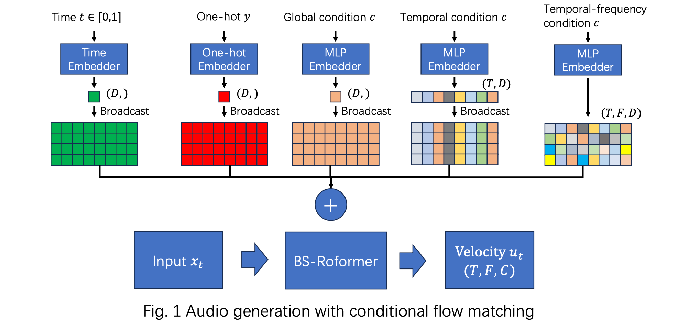

# AudioFlow: Audio Generation with Flow Matching

This repository contains a tutorial on audio generation using conditional flow matching implemented in PyTorch. Signals from any modality, including text, audio, MIDI, images, and video, can be converted to audio using conditional flow matching. The figure below shows the framework.



The supported tasks include:

| Tasks                   | Supported    | Dataset    | Config yaml                                                  |
|-------------------------|--------------|------------|--------------------------------------------------------------|
| Text to music           | ✅           | GTZAN      | [configs/text2music.yaml](configs/text2music.yaml)           |
| MIDI to music           | ✅           | MAESTRO    | [configs/midi2music.yaml](configs/midi2music.yaml)           |
| Codec to audio          | ✅           | MUSDB18HQ  | [configs/codec2audio.yaml](configs/codec2audio.yaml)         |
| Mono to stereo          | ✅           | MUSDB18HQ  | [configs/mono2stereo.yaml](configs/mono2stereo.yaml)         |
| Super resolution        | ✅           | MUSDB18HQ  | [configs/superresolution.yaml](configs/superresolution.yaml) |
| Music source separation | ✅           | MUSDB18HQ  | [configs/mss.yaml](configs/mss.yaml)                         |
| Vocal to music          | ✅           | MUSDB18HQ  | [configs/vocal2music.yaml](configs/vocal2music.yaml)         |


## 0. Install dependencies

```bash
# Clone the repo
git clone https://github.com/qiuqiangkong/audio_flow
cd audio_flow

# Install Python environment
conda create --name audio_flow python=3.13

# Activate environment
conda activate audio_flow

# Install Python packages dependencies
bash env.sh
```

## 1. Download datasets

Download the dataset corresponding to the task. 

GTZAN (1.3 GB, 8 hours):

```bash
bash ./scripts/download_gtzan.sh
```

The downloaded dataset after compression looks like:

MUSDB18HQ (30 GB, 10 hours):

```bash
bash ./scripts/download_musdb18hq.sh
```

To download more datasets please see [scripts](scripts).

## 2. Train

### 2.1 Train with single GPU

Here is an example of training a text to music generation system. Users can train different tasks viewing more config yaml files at [configs](configs).

```python
CUDA_VISIBLE_DEVICES=0 python train.py --config="./configs/text2music.yaml"
```

To run more examples please see [configs](configs).

### 2.2 Train with multiple GPUs

Users can use the Huggingface accelerate library for parallel training. train_accelerate.py just adds a few lines to train.py. Here is an example to run with 4 GPUs:

```python
CUDA_VISIBLE_DEVICES=0,1,2,3 accelerate launch --multi_gpu --num_processes 4 train_accelerate.py --config="./configs/text2music.yaml"
```

## Results

Here are the results after training with a single RTX 4090 GPU for 20 hours (200k steps). Users can achieve better performance with longer training times.

## Results

| Tasks                   | Condition    | Generated audio | Ground truth |
|-------------------------|--------------|-----------------|--------------|
| Text to music           | "blues"      | <video src=https://github.com/user-attachments/assets/1a62cb11-fdec-445a-a38c-3f5d9f82748e autoplay controls></video> | N.A.         |
| MIDI to music           | <video src=https://github.com/user-attachments/assets/81ce572a-f0da-4b69-bdd3-5be9d0c3e4d5> | <video src=https://github.com/user-attachments/assets/5f21234e-dc02-4b2a-b0f2-43d9d24d5775> | <video src=https://github.com/user-attachments/assets/6cecccd7-31f7-43da-a601-9cfc4e7e617f> |
| Super resolution        | <video src=https://github.com/user-attachments/assets/47d4428f-cdb5-400a-9257-15679f4de86f> | <video src=https://github.com/user-attachments/assets/13021a63-7530-49b7-b897-09a3bd004b10> | <video src=https://github.com/user-attachments/assets/b8330d99-2b58-4c98-b66e-ef2f265fe6ad> |
| Music source separation | <video src=https://github.com/user-attachments/assets/26a37757-ea88-4ab6-bab4-6dd3d1ac716c> | <video src=https://github.com/user-attachments/assets/d3022759-7f70-4abb-93c4-decd34438d31> | <video src=https://github.com/user-attachments/assets/45e32fb7-7210-4399-9079-be4991498ede> |


## Cite

```bibtex
@misc{audioflow2025,
  author       = {Qiuqiang Kong},
  title        = {AudioFlow},
  year         = {2025},
  howpublished = {\url{https://github.com/qiuqiangkong/audio_flow}},
}
```

## External links

[1] Conditional flow matching: https://github.com/atong01/conditional-flow-matching

[2] DiT: https://github.com/facebookresearch/DiT